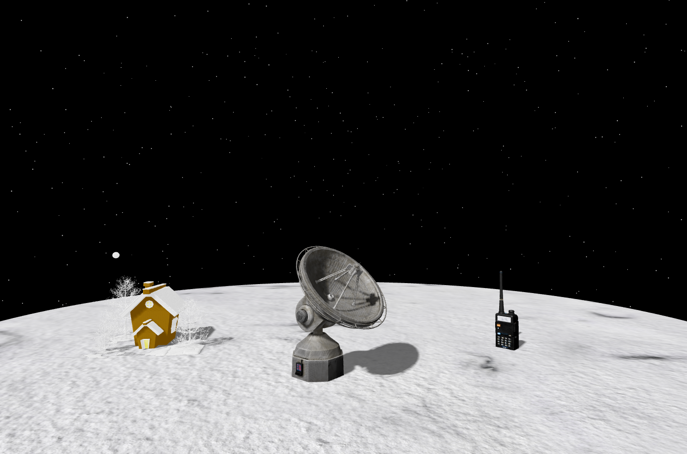
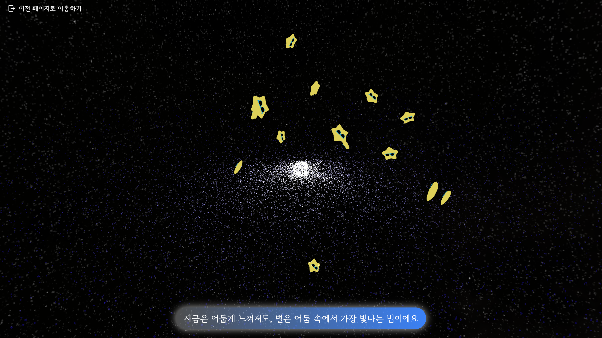
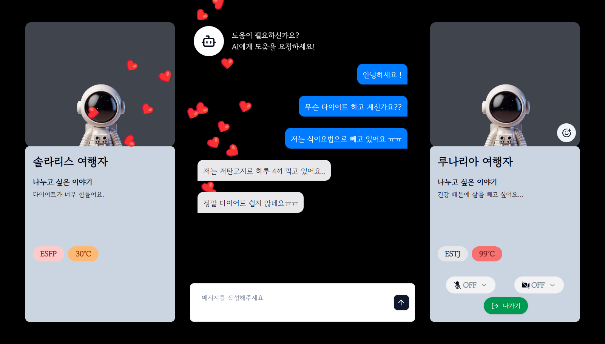

# 은하수다 (GalaxyTalk)

---

## 프로젝트 소개

우주 테마의 AI 기반 고민 유사도 점수를 활용한 1:1 매칭 화상 채팅 서비스


> 외로운 별들을 위한 빛나는 만남,
> 익명의 마음들이 전하는 따스한 위로,
> 고민 속에서 서로를 발견하며 함께 힐링해요

---

## 스크린샷

| 홈 | 매칭 대기 | 화상 채팅 |
| --- | --- | --- |
|  |  |  |

---

## 기술 스택

### Frontend

| 분류 | 라이브러리 |
| --- | --- |
| Core | React 19, Vite, TypeScript |
| 3D | React Three Fiber, Drei, @react-three/postprocessing |
| 화상통화 | LiveKit (livekit-client, @livekit/components-react) |
| 실시간 | STOMP.js, SockJS |
| 상태관리 | Zustand, TanStack Query v5 |
| UI | shadcn-ui, Tailwind CSS, motion |
| 모바일 | Capacitor (Android / iOS) |
| 개발 도구 | MSW, ESLint, Prettier |

### Backend / Infra

Spring Boot · MySQL · MongoDB · Redis · MSA (Gateway + Eureka) · Docker · Jenkins · Nginx

---

## 주요 기능

### 3D 우주 씬

React Three Fiber + Drei로 행성·은하수·별자리 등 우주 배경을 인터랙티브하게 구현했습니다. GLB 포맷의 위성 안테나·워키토키·눈집 등 3D 에셋을 로드하고 애니메이션을 처리하며, Postprocessing으로 빛 번짐 효과를 추가했습니다.

### WebRTC 화상 채팅

LiveKit 기반 1:1 화상·음성 통화를 제공합니다. 기본 UI를 그대로 쓰지 않고 커스텀 컨트롤바, 오디오 비주얼라이저, 이모지 리액션 패널을 직접 구현했습니다.

### 실시간 매칭

STOMP.js + SockJS WebSocket으로 매칭 대기·알림·수락/거절 흐름을 처리합니다. Zustand로 매칭 상태(대기 → 매칭 → 수락/거절 → 채팅)를 전역 관리합니다.

### AI 고민 유사도 매칭

사용자가 입력한 고민 텍스트를 FastAPI AI 서버로 전송해 임베딩 유사도를 계산하고, 가장 비슷한 고민을 가진 상대와 1:1로 연결합니다.

### 소셜 로그인

Kakao·Naver OAuth 2.0을 지원합니다. JWT Refresh Token Rotation 방식으로 토큰을 갱신합니다.

### 마이페이지

채팅 후 상대방에게 받은 편지 목록과 계정 메뉴를 제공합니다.

### MSW 목업

모든 API 엔드포인트에 대해 MSW 핸들러를 구성해, BE 없이 프론트엔드 독립 개발이 가능합니다.

### 모바일 앱

Capacitor로 웹 코드를 그대로 Android/iOS 네이티브 앱으로 빌드할 수 있습니다.

---

## 프로젝트 구조

Feature-Sliced Design(FSD) 아키텍처를 기반으로 구성했습니다.

```
Client/src/
├── app/          # 앱 진입점, 라우터, 전역 설정 및 스토어
├── pages/        # 페이지 단위 컴포넌트
│   ├── home/     # 랜딩 · 로그인 · 매칭 폼
│   ├── match/    # 매칭 대기 화면
│   ├── chatting/ # 화상 채팅 화면
│   ├── mypage/   # 마이페이지
│   └── signup/   # 회원가입
├── features/     # 도메인 기능 (user, match, feedback, letter)
├── widget/       # 3D 씬 컴포넌트 (Galaxy, Planet, SpaceWarp, SnowHouse 등)
└── shared/       # 공통 유틸, UI 컴포넌트, API 클라이언트, MSW 핸들러
```

---

## 로컬 실행

```bash
cd Client
npm install
npm run dev        # 웹 (브라우저)
npm run android    # Android 앱
npm run ios        # iOS 앱
```

---

## 아키텍처


---

## 팀원 & 역할

| 이름 | 역할 | 개발 내용 |
| --- | --- | --- |
| 민인애 | FE | LiveKit 화상·음성·텍스트 채팅 구현 (VideoRenderer, AudioVisualizer, ReactionPanel), 채팅 UI/UX, 피드백 기능, Three.js 최적화 |
| 박유진 | FE | 3D 씬 구현 (React Three Fiber), 소셜 로그인 · 회원가입, 매칭 상태 관리, 마이페이지 |
| 김준형 | Infra |  |
| 박도아 | BE |  |
| 차수홍 | BE |  |
| 홍찬우 | BE |  |
